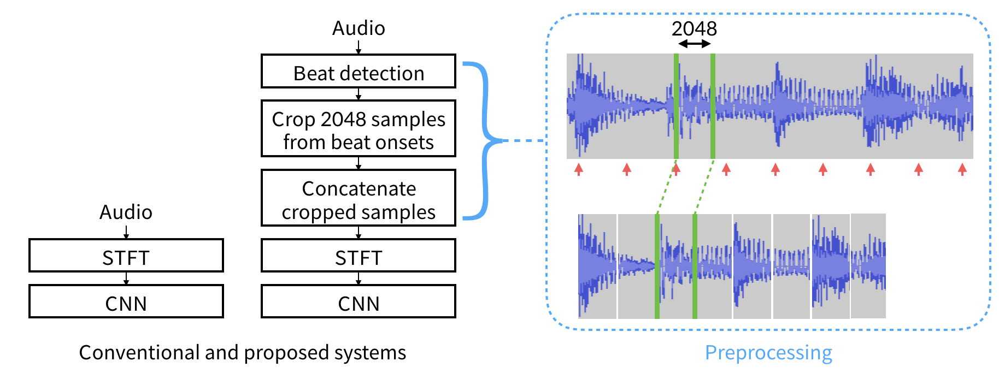

# Rhythmic Pattern Recognition with Transposed Audio
This repository includes a preprocessing step for the rhythmic pattern recognition using convolutional neural networks. Basic concept of this approach is to transpose all the audio into a single tempo so that the network can learn **rhythmic patterns** better. `report.ipynb` reports some experimental results and discussion.


## Requirements
All the libraries except `essentia` can be installed using `pip`.

- **python 2.7**

- **keras**

- **keras-vis**

- **numpy**

- **scipy**

- **sklearn**

- **cPickle**

- **librosa**

- **madmom**

- **essentia** [Docker image](https://github.com/MTG/essentia-docker)

- **fire**

- **tqdm**

- **matplotlib**

- **seaborn**

## Dataset
I used extended ballroom dataset. [[link](http://anasynth.ircam.fr/home/media/ExtendedBallroom)] [[paper](https://wp.nyu.edu/ismir2016/wp-content/uploads/sites/2294/2016/08/marchand-extended.pdf)]


## Preprocessing
There are four steps for the preprocessing.

- **\_1\_downsample.py** downsamples audio into 16kHz
- **\_2\_transpose.py** transposes audio files into a single tempo
- **\_3\_get_melspec.py** gets log-mel spectrograms
- **\_4\_stratified_split.py** splits train and validation sets

Modify all paths of audio files and spectrograms for your setup. And run each step in order.

```
. 1_downsample.sh

. 2_transpose.sh

. 3_get_melspec.sh

python _4_stratified_split.py
```

Now you can train your network with transposed audio!

Below describes the detail of `\_2\_transpose.py`. I did not use time-stretching because it changes the timbre of original audio. Instead, I hypothesized that samples around beat onsets have more important information.




## Training
For the comparison, I testified a simple _vgg_-like CNN model. 

- a model with original spectrograms: `RhythmRecognition/training/spec_normal` 

- a model with transposed spectrograms: `RhythmRecognition/training/spec_minz`

You have to modify the spectrogram path in `fit.py`.

Start training `. run.sh` 

## Time-stretching
To follow the **Experiment I** and **Experiment II** in `report.ipynb`, step 5-7 of preprocessing are needed.

- **\_5\_fool.py** processes time-stretching
- **\_6\_fool_transpose.py** transposes time-stretched audio files into a single tempo using proposed preprocessing method
- **\_7\_fool_melspec.py** gets log-mel spectrograms

You have to modify file paths and time-stretching rate in `_5_fool.py`. And run.

```
. 5_fool.sh

. 6_fool_transpose.sh

. 7_fool_melspec.sh

```
